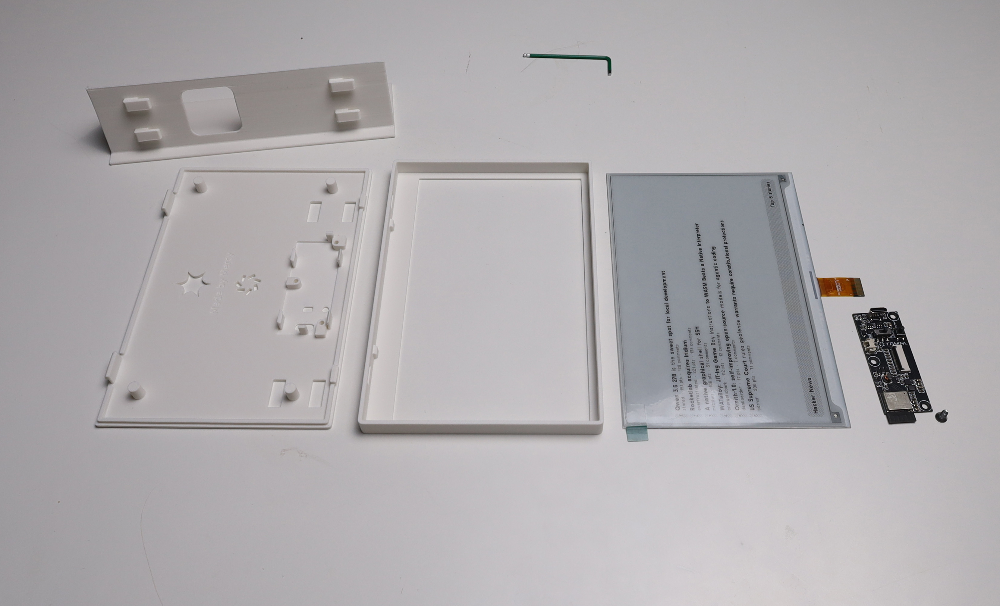
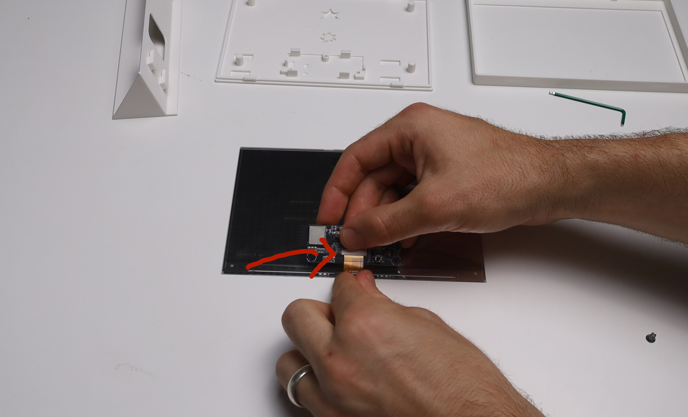
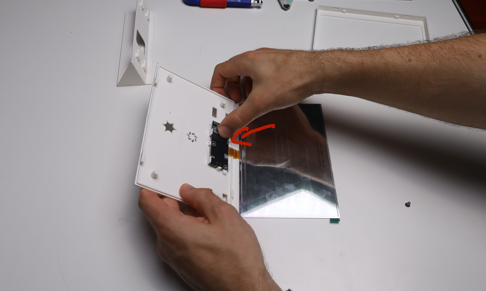
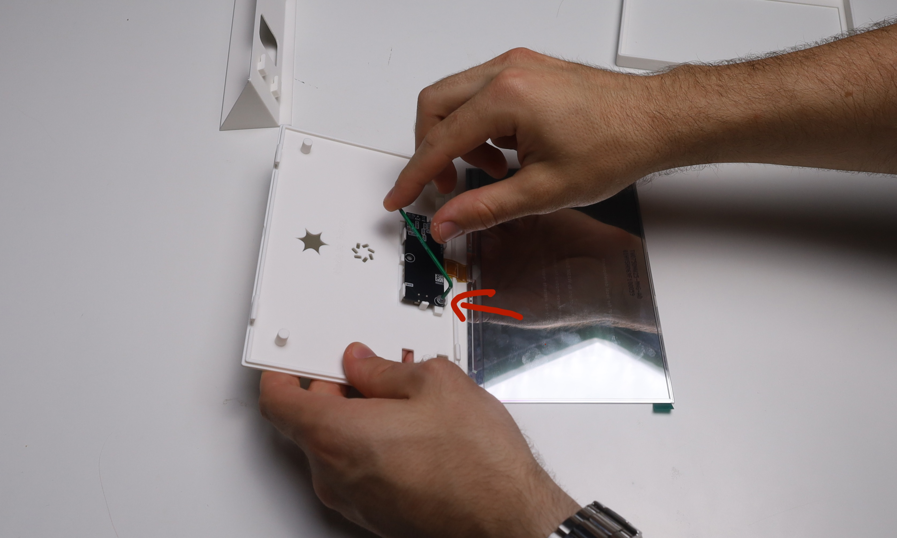

We are hosting a hackathon together with TRMNL where we develop new open source plugins for the community. This document walks you through the setup.

## Prerequisites

We assume you know how to use a terminal (as in, the command line) and Git/GitHub. If you're on Windows, please use WSL if possible. If you have questions about anything, please ask.

## Assembling your device



Watch [this video][assembly-video] until 0:29 and follow the steps: Remove the protective film and connect ribbon cable to PCB. Be careful! If the ribbon cable breaks, you are royally fucked. If you are having issues, watch [this video](https://www.youtube.com/watch?v=dQw4w9WgXcQ).



Press the PCB into the backplate until it snaps in. Hold the backplate in your hand: if it were to lay on the table, the USB-C connector would push the PCB up.



We have three holes but only one screw. Screw the PCB into the hole next to the USB-C connector, so it sits firmly in place.



Check if it sits right by trying to flip the switch on the backside of the backplate. If you can't flip it with your fingernail, it doesn't sit properly. Then, put the display into the frame.


Close the case by aligning the backplate with the indents on the lower side of the frame and then pressing it shut.


Almost done! Now, you still need to slide the stand onto the back.


And just like that, you are ready to go.


## Getting started with the software

First, go to <https://trmnl.hpi.church> in your browser and click "Sign up". Use any email (it doesn't have to exist) and a secure password.


This is going to be the server which will serve images to your TRMNL. An admin will have to approve your account:


Once approved, log in again. You will now be able to register a device.

### Setting up your TRMNL

The device should display a "Friendly ID". Note it somewhere, you'll need it. Go into your wifi settings (easier on your phone) and look for the TRMNL-\<YOUR_FRIENDLY_ID\> wifi. Connect to it.

A captive portal should open. Scroll down and click on Advanced, then on Custom URL. Click Yes and enter <https://trmnl.hpi.church> into the field (do not skip the "https://"!).

Scroll down and click on Save, then Back to wifi. Now, look for the TRMNL Public SSID and enter the password (it will be written somewhere in the room). Then click Connect.

After some time, the device should display a rather big TRMNL logo. If not, try pressing the reset button and wait for a bit. If that doesn't help, ask us or people around you for help.

Now, open <https://trmnl.hpi.church> again and go to the Devices section. Find the device with your Friendly ID and rename it to MYNAME's TRMNL (to edit, click the eye icon).

After registering your device, click on your profile in the top right and head to Settings -> API Tokens. Generate a token named "trmnlp" and set it aside.

## Development setup

First fork the repo [trmnl-plugins] and clone the fork into a folder of your choice. It will be used to gather all submissions later.

We're going to be developing plugins using `trmnlp`. To get started, you need to install Ruby 4 on your machine. It may be already installed on your system.

Try running

```sh
ruby -v
```

to see whether you have Ruby installed. If this returns version 4, you're done; otherwise, install it using your package manager. If you're on Windows, use [rubyinstaller] (the non-devkit version).

After installing, the `gem` command (the Ruby package manager) should become available. Run

```sh
gem install trmnl_preview
```

which will install the development tool we need.

> [!INFO] Build failed
> If this fails with "ERROR: Failed to build gem native extension", you might need additional C/C++ compiler tooling. On Deb-based distros, try installing `build-essential`. On RPM-based distros, try installing `ruby-devel`. On macOS, you might need the Command Line Developer tools.

Now, log in using the token we created earlier. Run

```sh
trmnlp login --server https://trmnl.hpi.church
```

then paste the token and hit Enter.


## Scaffolding your first plugin

To begin building your plugin, we will first initialize a project using `trmnlp`. Change into any directory, then run

```sh
trmnlp init your-brand-new-plugin
```

which will create a plugin in `your-brand-new-plugin/`.

> [!WARNING] IMPORTANT
> Delete the `.git` folder _in the newly created folder_ (`your-brand-new-plugin`), _NOT_ the `.git` folder in the `trmnl-plugins` folder!
> If you skip this, it will cause problems later on.

Open the new directory in your editor and edit `src/settings.yml`.


Update the line that says

```yml
name: My Plugin
```

to something else, like

```yml
name: My amazing plugin!
```

Then, run

```sh
trmnlp serve
```

and open the URL it prints (<http://localhost:4567>) in your browser. This will preview your plugin inside the browser and update as you change it. For example, try changing the "Hello, TRMNL!" inside `src/full.liquid` to "Hello, TRMNL x Spark!".


Keep this running and check it after changes for when we continue to edit our example plugin. But for now, let's take a step back and look at what a plugin actually contains.

### Anatomy of a plugin

A plugin consists of up to 6-7 files: the `settings.yml`, a [transform file][trmnl-serverless] if needed and five [Liquid templates][liquid-docs] for the different splits and for shared code. It runs in one of three modes:

- Static, where template data is a static blob of JSON (duh)
- Polling, where JSON data is fetched from an API and optionally edited by a serverless function
- [Webhooks], where data is pushed to the server from an external service

The `.liquid` files are templates outputting HTML, organized by different layouts. We will be focusing on the `full.liquid` file used when your plugin fills the entire device's screen. Additionally, you can share code between templates using the [`shared.liquid`][shared-liquid].


## Building your plugin

> Note: This part of the guide is mostly to help understand the plugins, you do not have to follow along if you do not want to, but it may help.

Now, we will walk through building an actual plugin which polls data from Hacker News, based on the `trmnlp` example plugin. On the top level, a TRMNL liquid template consists of two `div`s; a `div.view` containing a `div.layout` (the content) and most of the time, a `div.title_bar` (the bottom bar). We will start with this code snippet for `full.liquid`:

```html
<div class="view view--{{ size }}">
<div class="layout">

</div>

<div class="title_bar">
  <span class="title">Hacker News</span>
  <span class="instance">Top {{ fetched_count }} stories</span>
</div>
</div>
```

This template already contains a variable, `fetched_count`. Liquid expressions are surrounded by `{{ }}` or ``, depending on the expression. To render this, we need to specify some data. Let's take a look at what [our example API][hackernews-api] gives us:

> **New, Top and Best Stories**  
> Up to 500 top and new stories are at `/v0/topstories` (also contains jobs) and `/v0/newstories`. Best stories are at `/v0/beststories`.
> Example: [hn-topstories]
>
> ```json
> [9128264, 9127792, 9129248, 9127092, 9128367, ..., 9038733]
> ```

That doesn't help too much, because we can't do anything with these IDs yet. Querying `/v0/item/<id>` would help, but we can specify only a fixed list of URLs to query inside Larapaper. To circumvent this, we can use a ["serverless transform"][trmnl-serverless]: an arbitrary function in Python, JS, or PHP which runs on the server, like a poor man's AWS Lambda.

First, let's configure our plugin. In `src/settings.yml`, update the following keys:

```yml
strategy: polling
polling_verb: get
polling_url: https://hacker-news.firebaseio.com/v0/topstories.json
polling_headers: ""
serverless_language: python
```

Then, we can write a `src/transform.py` to modify the data:

```python
import requests


def run(input):
    ids = input.get("data", [])[:6] # get the 6 top stories

    stories = []
    for idx, id in enumerate(ids, start=1):
        item = requests.get(f"https://hacker-news.firebaseio.com/v0/item/{id}.json").json()

        stories.append(
            {
                "rank": idx,
                "title": item.get("title", ""),
                "by": item.get("by", ""),
                "score": item.get("score", 0),
                "comments": item.get("descendants", 0),
            }
        )

    return {"stories": stories, "fetched_count": len(stories)}
```

This takes in the initial response (`input["data"]`) and turns it into a list of JSON objects, as well as the `fetched_count` we used earlier. Now, we can update our template to iterate over `stories`. Inside the layout `div` from earlier, insert

```html
<div class="grid grid--cols-1 gap--small">
  
    <div class="item">
      <div class="meta">
        <span class="index">{{ story.rank }}</span>
      </div>
      <div class="content">
        <span class="title title--small" data-clamp="2">{{ story.title }}</span>
        <span class="description">{{ story.by }} &nbsp;·&nbsp; {{ story.score }} pts &nbsp;·&nbsp; {{ story.comments }} comments</span>
      </div>
    </div>
  
</div>
```

We can access the fields of our JSON objects using `.field` notation. For control structures, see the Liquid reference at the bottom of the document.

## Uploading your plugin to your device

Once you're done with your changes, run

```sh
trmnlp push
```

which will upload the plugin to the server. Now, you should be able to see your plugin at <https://trmnl.hpi.church> (alternatively, open the URL `trmnlp push` printed):


Click the name of your plugin. This will open the following page:


Here, you can view and edit the code of the plugin, but more importantly, you can add it to playlists. Click the large "add to playlist" button.


Check the box with your device's name, and create a playlist if one doesn't exist already. Leave the scheduling options as-is and keep the layout as full. Give it any name, like Hackathon.

Turn on your TRMNL and press the reset button. Now, the image on it should update to the plugin you created. The dashboard view will only update when polled from the device. For previewing a plugin, use `trmnlp` or the preview button on the plugin page.


## Resources and references

There are existing catalogues of so-called "Recipes". These are published plugins you can download.
Use these as inspiration, but keep in mind that if you clone an existing plugin (which is totally fine!) you will not be selected as a winner.

| Resource         | URL                  |                                                                                  |
| ---------------- | -------------------- | -------------------------------------------------------------------------------- |
| Recipe catalogue | [trmnl recipes]      | Official catalogue of community plugins                                          |
| OSS catalogue    | [OSS recipes]        | Community catalogue of open-source plugins                                       |
| TRMNL framework  | [framework]          | Complete documentation by TRMNL on how to design the dashboards + examples       |
| trmnlp           | [trmnlp]             | Dev tool we installed earlier                                                    |
| trmnl-liquid     | [trmnl-liquid]       | TRMNL's custom Liquid filters and tags (date and currency formatting, and more). |
| Liquid docs      | [liquid-docs]        | The base templating language: Loops, conditionals, and filters.                  |
| Agent Skills     | [trmnl-agent-skills] | TRMNL's official AI skill                                                        |

### Building plugins with an LLM

If you're using an AI assistant to write your plugin, you should use the agent skill above, otherwise the agent will probably invent utility classes or fall back to Tailwind.

See the agents skill repo above for installation instructions. If your harness is unsupported, copy all files in `skills/trmnl/references` directly to your repository and instruct your agent to read it.

If your agent asks about configuring an MCP server then refuse; the MCP server is part of trmnl.com and not available with BYOS deployments.

## Tips and tricks

- TRMNL's utility classes might look like Tailwind, but they are not. Tailwind classes will be ignored.
  - Use the framework's grayscale classes (`bg--black`, `bg--gray-60`, `bg--gray-30`, `bg--white`) instead of hex colours. The panels here are 2-bit (4 shades of gray); the framework also handles 1-bit and 4-bit devices and falls back via dithering. See the [TRMNL help article about grayscale].
- The HTML output rendered by `trmnlp serve` is not entirely accurate, you can turn on a more accurate but slower PNG output in the top bar. This requires imagemagick to be installed globally.
- Use [serverless transforms][trmnl-serverless] to modify incoming API data if needed. Please note that runtime is restricted to 30s per transform and that Ruby is unsupported. For JS, ensure to `export` the run function.
  - When testing with `trmnlp`, transforms require the appropriate interpreter to be installed.
- For Home Assistant or other polled APIs, put the token in `polling_headers` as `Authorization: Bearer <TOKEN>`.

## How to submit your plugin

Once you are done developing, please submit your plugin! Only submitted plugins will be respected in the voting.

Push all your changes to your fork of the `trmnl-plugins` repo and create a Pull Request from your fork, back to the main `trmnl-plugins` repo. If you do not know how, please ask.

## Glossary

| Term                  | Acronym | Definition                                                                                                                         |
| --------------------- | ------- | ---------------------------------------------------------------------------------------------------------------------------------- |
| Dithering             |         | Noise filter used to create an illusion of more colour depth                                                                       |
| Build your own server | BYOS    | Term used by TRMNL to describe self-hostable open-source servers compatible with their devices                                     |
| Larapaper             |         | BYOS server written in Laravel, which is what we're using for this hackathon                                                       |
| Liquid                |         | Templating language used by plugins                                                                                                |
| Templating language   |         | Markup language with control structures. Usually directly transpiles to another markup language, often HTML                        |
| Jason                 | JSON    | Ex-Google engineer who invented a markup language for structured data, named after his online handle @json. Died of ligma in 2012. |

## Legal

Entrants retain ownership of all intellectual and industrial property rights (including moral rights) in and to submissions. However, you agree to license your contribution as free and open-source software under the terms of the [European Union Public License][eupl], a GPL-compatible copyleft license. If you don't know what that means, then you probably don't have to worry about it. If you take issue with this, please talk to us.

[trmnl-plugins]: https://github.com/spark-hpi/trmnl-plugins
[rubyinstaller]: https://rubyinstaller.org
[Webhooks]: https://docs.trmnl.com/go/private-plugins/webhooks
[shared-liquid]: https://trmnl.com/blog/private-plugin-shared-markup
[hackernews-api]: https://github.com/hackernews/api
[hn-topstories]: https://hacker-news.firebaseio.com/v0/topstories.json
[trmnlp]: https://github.com/usetrmnl/trmnlp
[liquid-docs]: https://shopify.github.io/liquid/
[trmnl-agent-skills]: https://github.com/usetrmnl/trmnl-agent-skills
[TRMNL help article about grayscale]: https://help.trmnl.com/en/articles/12386214-grayscale-1-bit-2-bit-4-bit-in-framework
[trmnl-serverless]: https://help.trmnl.com/en/articles/14130649-serverless
[trmnl-liquid]: https://github.com/usetrmnl/trmnl-liquid
[framework]: https://trmnl.com/framework
[assembly-video]: https://youtu.be/Z64FDqIaKpg
[trmnl recipes]: https://trmnl.com/recipes
[OSS recipes]: https://bnussbau.github.io/trmnl-recipe-catalog/
[eupl]: https://eupl.eu
